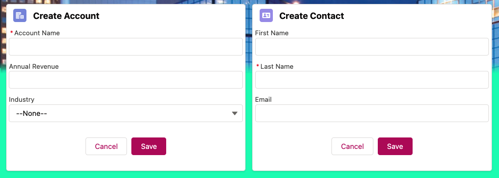

# Record Creator LWC
Lightning web components to create a new Account and Contact record.



## accountCreator Component
```html
<template>
    <lightning-card title="Create Account" icon-name="standard:account">
        <lightning-record-form
            object-api-name={objectApiName}
            fields={fields}
            onsuccess={handleSuccess}>
        </lightning-record-form>
    </lightning-card>
</template>
```
```js
import { LightningElement } from 'lwc';
import { ShowToastEvent } from 'lightning/platformShowToastEvent';
import ACCOUNT_OBJECT from '@salesforce/schema/Account';
import NAME_FIELD from '@salesforce/schema/Account.Name';
import REVENUE_FIELD from '@salesforce/schema/Account.AnnualRevenue';
import INDUSTRY_FIELD from '@salesforce/schema/Account.Industry';

export default class AccountCreator extends LightningElement {
    objectApiName = ACCOUNT_OBJECT;
    fields = [NAME_FIELD, REVENUE_FIELD, INDUSTRY_FIELD];
    handleSuccess(event) {
        const toastEvent = new ShowToastEvent({
            title: "Account created",
            message: "Record ID: " + event.detail.id,
            variant: "success"
        });
        this.dispatchEvent(toastEvent);
    }
}
```
## contactCreator Component
```html
<template>
    <lightning-card title="Create Contact" icon-name="standard:contact">
        <lightning-record-form
        object-api-name={objectApiName}
        fields={fields}
        onsuccess={handleSuccess}>
        </lightning-record-form>
    </lightning-card>
</template>
```
```js
import { LightningElement } from 'lwc';
import { ShowToastEvent } from 'lightning/platformShowToastEvent';
import CONTACT_OBJECT from '@salesforce/schema/Contact';
import FIRSTNAME_FIELD from '@salesforce/schema/Contact.FirstName';
import LASTNAME_FIELD from '@salesforce/schema/Contact.LastName';
import EMAIL_FIELD from '@salesforce/schema/Contact.Email';

export default class ContactCreator extends LightningElement {
    objectApiName = CONTACT_OBJECT;
    fields = [FIRSTNAME_FIELD, LASTNAME_FIELD, EMAIL_FIELD];
    handleSuccess(event) {
        const toastEvent = new ShowToastEvent({
            title: "Contact created",
            message: "Record ID: " + event.detail.id,
            variant: "success"
        });
        this.dispatchEvent(toastEvent);
    }
}
```
